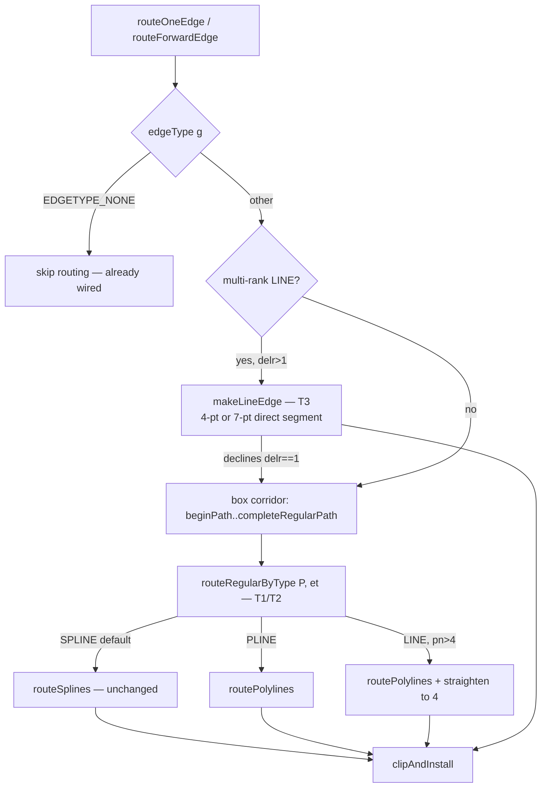

# Edge-type dispatch map

Emit points wired in T2: `edge-route-faithful.ts:332`,
`edge-route-chain.ts:137`, `edge-route-chain.ts:268`.
C spec: `dotsplines.c:make_regular_edge` (1757-1861), `makeLineEdge` (1636).
