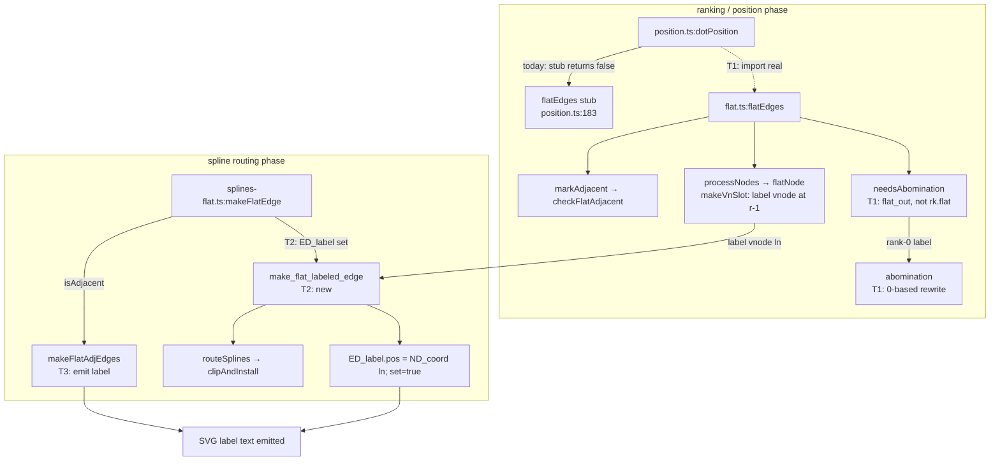

# Component map — flat-label dispatch

## Task → component

- **T1** — `position.ts` (wire `flatEdges`), `flat.ts` (`needsAbomination`,
  `abomination`, `flatNode`/`makeVnSlot`).
- **T2** — `splines-flat.ts` (`make_flat_labeled_edge` + dispatch, non-adjacent).
- **T3** — `splines-flat.ts` (`makeFlatAdjEdges` label emission, adjacent).
