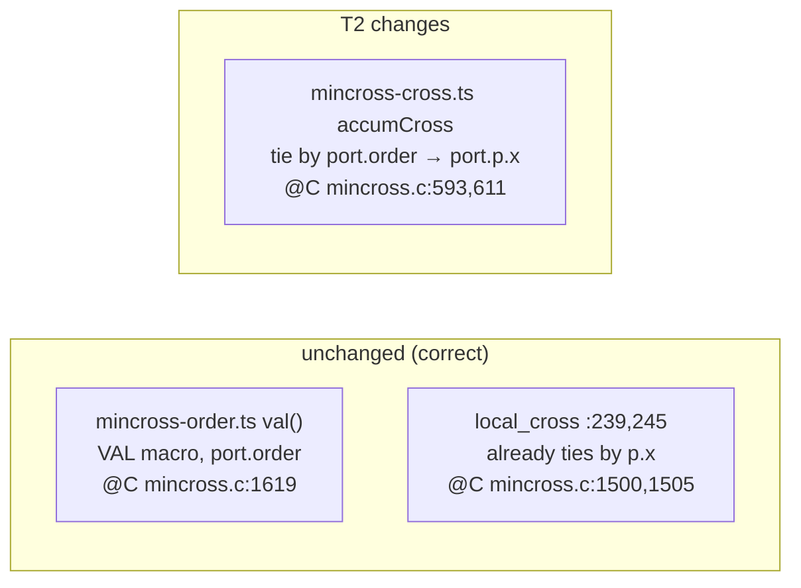

# G2 — where the compass-port signal is lost

## The divergence (one comparator)

```mermaid
flowchart TD
  A["edge a:e->b, a:w->c, a->d<br/>chkPort at edge-init<br/>(edge-label-init.ts)"]
  A --> B["tail_port.p.x = +lw / -lw / 0<br/>tail_port.order = 0"]
  B --> C{"mincross crossing count<br/>in_cross / out_cross"}
  C -->|"C mincross.c:593,611<br/>tie → port.p.x"| D["order [c,d,b] ✓<br/>a.cx = 99"]
  C -->|"TS accumCross:110,114<br/>tie → port.order (=0)"| E["order [d,c,b] ✗<br/>a.cx = 126"]
  E -.fix: tie by p.x.-> D
```

## Faithful fix locus



The fix touches exactly one comparator. The splines and position phases are
already faithful — node `a` lands at x=126 only because mincross hands them the
wrong rank order.
