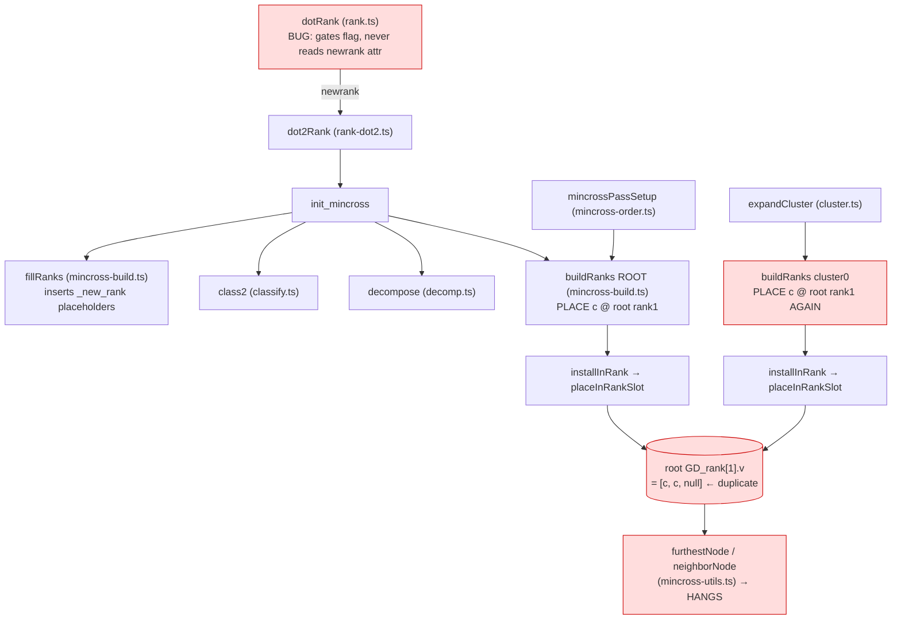

# Component map — newrank rank-build path

The double-install of `c` (the hang) happens because both the root and cluster0
`build_ranks` install `c` into the **shared root rank array**.

The faithful question (Batch 1): in C, why is `c` NOT installed by both? C
collapses cluster members behind a CLUSTER pseudo-node at the enclosing level so
the root `build_ranks` installs the cluster as one node, and the cross-cluster
`rank=same` is resolved without double-routing `c`. The TS divergence is the
mission target.
