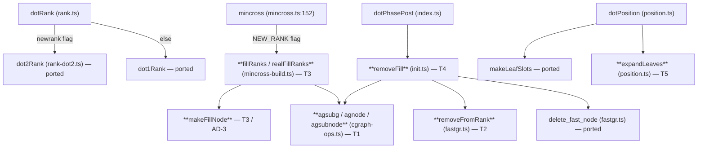
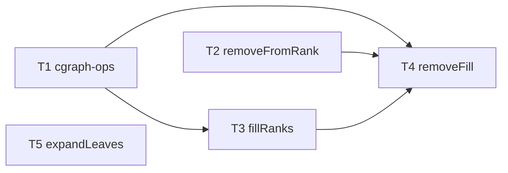

# Component Map — DOT-newrank

Existing wiring (ported) in black; stub bodies this mission fills in **bold**.

```mermaid
graph TD
  dotRank["dotRank (rank.ts)"] -->|newrank flag| dot2Rank["dot2Rank (rank-dot2.ts) — ported"]
  dotRank -->|else| dot1Rank["dot1Rank — ported"]
  mincross["mincross (mincross.ts:152)"] -->|NEW_RANK flag| fillRanks["**fillRanks / realFillRanks** (mincross-build.ts) — T3"]
  fillRanks --> makeFillNode["**makeFillNode** — T3 / AD-3"]
  fillRanks --> agsubg["**agsubg / agnode / agsubnode** (cgraph-ops.ts) — T1"]
  dotPhasePost["dotPhasePost (index.ts)"] --> removeFill["**removeFill** (init.ts) — T4"]
  removeFill --> agsubg
  removeFill --> removeFromRank["**removeFromRank** (fastgr.ts) — T2"]
  removeFill --> delFast["delete_fast_node (fastgr.ts) — ported"]
  dotPosition["dotPosition (position.ts)"] --> makeLeafSlots["makeLeafSlots — ported"]
  dotPosition --> expandLeaves["**expandLeaves** (position.ts) — T5"]
```

Dependency edges between this mission's tasks:

```mermaid
graph LR
  T1["T1 cgraph-ops"] --> T3["T3 fillRanks"]
  T1 --> T4["T4 removeFill"]
  T2["T2 removeFromRank"] --> T4
  T3 --> T4
  T5["T5 expandLeaves"]
```
