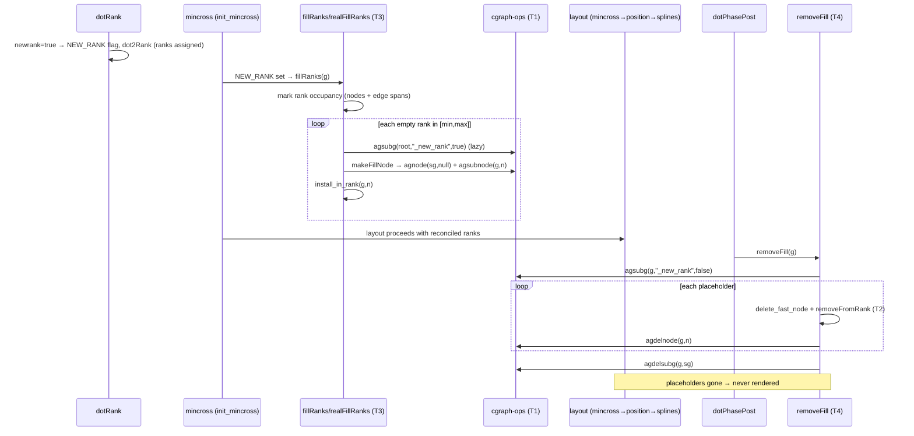

# Data Flow — newrank fill-node lifecycle

```mermaid
sequenceDiagram
  participant R as dotRank
  participant M as mincross (init_mincross)
  participant F as fillRanks/realFillRanks (T3)
  participant C as cgraph-ops (T1)
  participant L as layout (mincross→position→splines)
  participant P as dotPhasePost
  participant X as removeFill (T4)

  R->>R: newrank=true → NEW_RANK flag, dot2Rank (ranks assigned)
  M->>F: NEW_RANK set → fillRanks(g)
  F->>F: mark rank occupancy (nodes + edge spans)
  loop each empty rank in [min,max]
    F->>C: agsubg(root,"_new_rank",true) (lazy)
    F->>C: makeFillNode → agnode(sg,null) + agsubnode(g,n)
    F->>F: install_in_rank(g,n)
  end
  M->>L: layout proceeds with reconciled ranks
  P->>X: removeFill(g)
  X->>C: agsubg(g,"_new_rank",false)
  loop each placeholder
    X->>X: delete_fast_node + removeFromRank (T2)
    X->>C: agdelnode(g,n)
  end
  X->>C: agdelsubg(g,sg)
  Note over X,L: placeholders gone → never rendered
```
