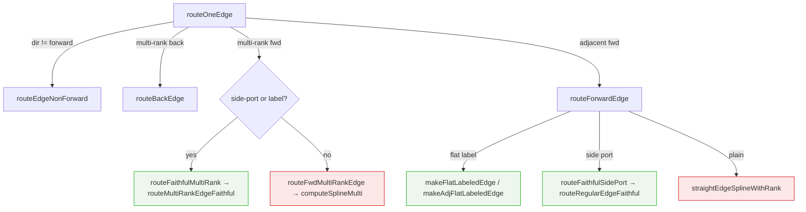
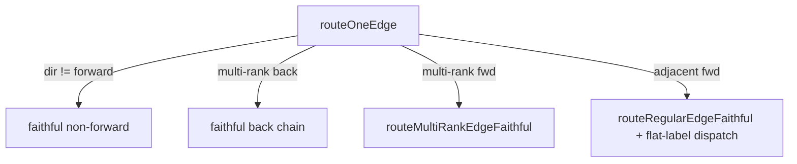

# Routing dispatch map

Current dispatch in `edge-route.ts:routeOneEdge`. Bold = simplified fitter
(to retire); italic = faithful path (to become the only path).

## Migration target

| Category | Today | Batch |
|----------|-------|-------|
| adjacent fwd, side-port / label | faithful | done |
| adjacent fwd, plain | **fitter** | T2 |
| multi-rank fwd, label/port | faithful | done |
| multi-rank fwd, plain | **fitter** (computeSplineMulti) | T3 |
| multi-rank back | **fitter/chain** | T4 |
| non-forward (dir=back/both/none) | **fitter** | T4 |
| rankdir=LR/RL/BT (all above) | **fitter** | T5 verify |
| fitter deletion | — | T6 |
