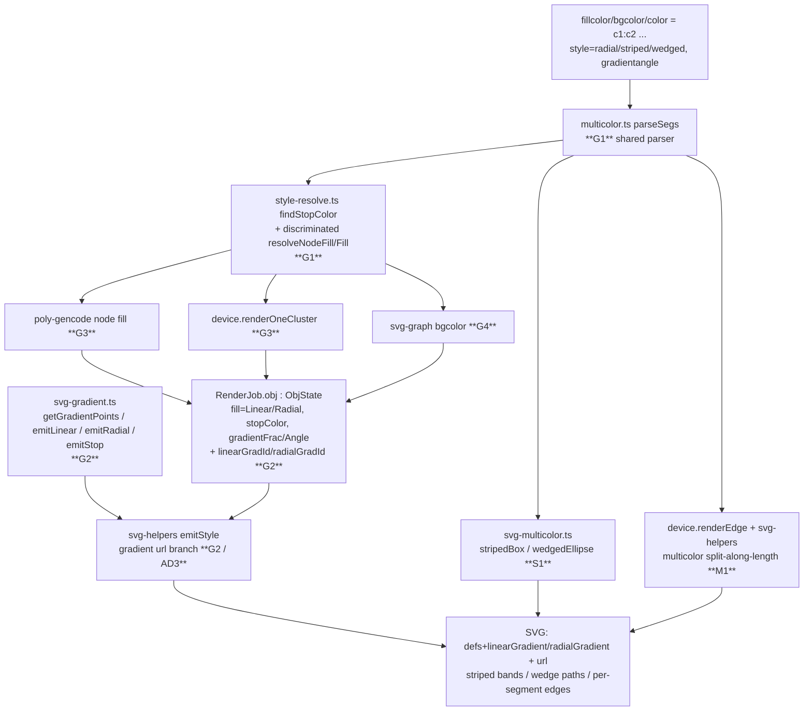

# Component map — multicolor paint

```mermaid
graph TD
  ATTR[fillcolor/bgcolor/color = c1:c2 ...<br/>style=radial/striped/wedged, gradientangle]
  PARSE[multicolor.ts parseSegs<br/>**G1** shared parser]
  FSC[style-resolve.ts findStopColor<br/>+ discriminated resolveNodeFill/Fill<br/>**G1**]
  GEMIT[svg-gradient.ts<br/>getGradientPoints / emitLinear / emitRadial / emitStop<br/>**G2**]
  JOB[RenderJob.obj : ObjState<br/>fill=Linear/Radial, stopColor, gradientFrac/Angle<br/>+ linearGradId/radialGradId **G2**]
  EMIT[svg-helpers emitStyle<br/>gradient url branch **G2 / AD3**]
  NODE[poly-gencode node fill **G3**]
  CLUS[device.renderOneCluster **G3**]
  BG[svg-graph bgcolor **G4**]
  MREG[svg-multicolor.ts<br/>stripedBox / wedgedEllipse **S1**]
  MEDGE[device.renderEdge + svg-helpers<br/>multicolor split-along-length **M1**]
  SVG[SVG: defs+linearGradient/radialGradient + url<br/>striped bands / wedge paths / per-segment edges]

  ATTR --> PARSE
  PARSE --> FSC
  PARSE --> MREG
  PARSE --> MEDGE
  FSC --> NODE --> JOB
  FSC --> CLUS --> JOB
  FSC --> BG --> JOB
  GEMIT --> EMIT
  JOB --> EMIT --> SVG
  MREG --> SVG
  MEDGE --> SVG
```
