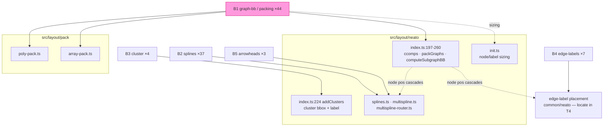

<!-- SPDX-License-Identifier: EPL-2.0 -->

# Component map — neato divergence buckets → source

Cascade: `index.ts` component placement determines node coords → any spline,
label, or arrowhead attached to a moved node diverges. Fix B1, re-sweep, then
the residual B2/B4/B5 sets shrink to their genuine (non-cascade) defects.
