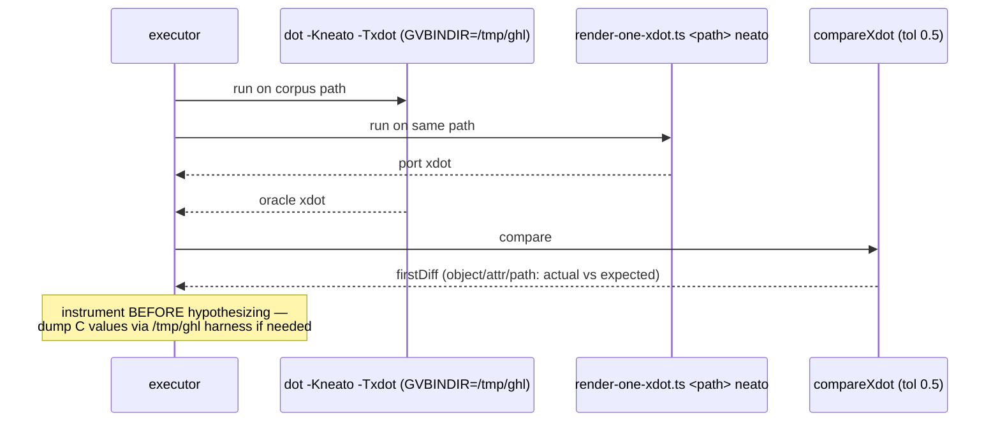

<!-- SPDX-License-Identifier: EPL-2.0 -->

# Data flow — diagnosis & verification loop

## Per-id reproduction (fast inner loop, no commit)



## Per-batch gate (before commit)

```mermaid
sequenceDiagram
  participant Dev as executor
  participant Gate as test/golden/gates.sh
  participant Sweep as engine-walk.ts (fresh, deleted-JSONL)
  Dev->>Gate: bash test/golden/gates.sh
  Gate-->>Dev: tsc + vitest + golden 50/50 + file<600 + bundle
  Dev->>Sweep: neato (target) — diverged must drop, 0 id regressions
  Dev->>Sweep: circo/twopi/osage/patchwork + npm run survey (dot)
  Sweep-->>Dev: 0 previously-passing ids regress BY ID
  Note over Dev: only then — one commit per task,<br/>fix(TN): ... ; append decision-journal
```
