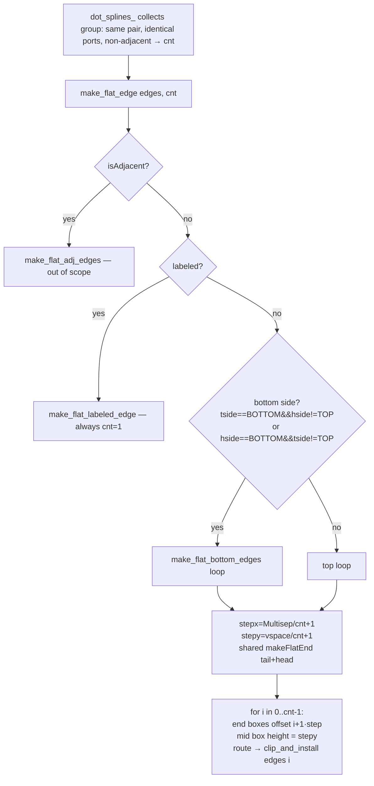
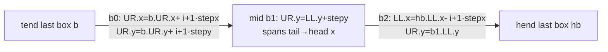
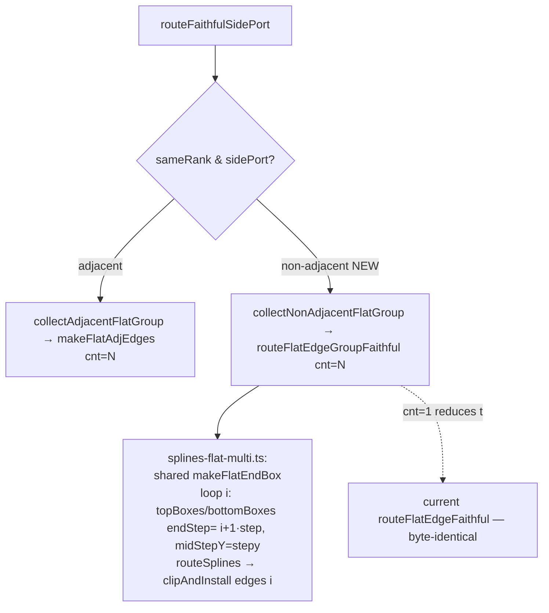

# Box-channel diagrams — non-adjacent flat cnt-loop

## C make_flat_edge control flow (per group)

```mermaid
flowchart TD
  A[dot_splines_ collects group: same pair, identical ports, non-adjacent → cnt] --> B[make_flat_edge edges, cnt]
  B --> C{isAdjacent?}
  C -->|yes| D[make_flat_adj_edges — out of scope]
  C -->|no| E{labeled?}
  E -->|yes| F[make_flat_labeled_edge — always cnt=1]
  E -->|no| G{bottom side?<br/>tside==BOTTOM&&hside!=TOP<br/>or hside==BOTTOM&&tside!=TOP}
  G -->|yes| H[make_flat_bottom_edges loop]
  G -->|no| I[top loop]
  H --> J
  I --> J[stepx=Multisep/cnt+1<br/>stepy=vspace/cnt+1<br/>shared makeFlatEnd tail+head]
  J --> K[for i in 0..cnt-1:<br/>end boxes offset i+1·step<br/>mid box height = stepy<br/>route → clip_and_install edges i]
```

## Per-i box channel (top branch)

```mermaid
flowchart LR
  T[tend last box b] -->|b0: UR.x=b.UR.x+ i+1·stepx<br/>UR.y=b.UR.y+ i+1·stepy| M[mid b1: UR.y=LL.y+stepy<br/>spans tail→head x]
  M -->|b2: LL.x=hb.LL.x- i+1·stepx<br/>UR.y=b1.LL.y| H[hend last box hb]
```

## Port mapping

```mermaid
flowchart TD
  P[routeFaithfulSidePort] --> Q{sameRank & sidePort?}
  Q -->|adjacent| R[collectAdjacentFlatGroup → makeFlatAdjEdges cnt=N]
  Q -->|non-adjacent NEW| S[collectNonAdjacentFlatGroup → routeFlatEdgeGroupFaithful cnt=N]
  S --> U[splines-flat-multi.ts:<br/>shared makeFlatEndBox<br/>loop i: topBoxes/bottomBoxes endStep= i+1·step, midStepY=stepy<br/>routeSplines → clipAndInstall edges i]
  S -.cnt=1 reduces to.-> V[current routeFlatEdgeFaithful — byte-identical]
```
