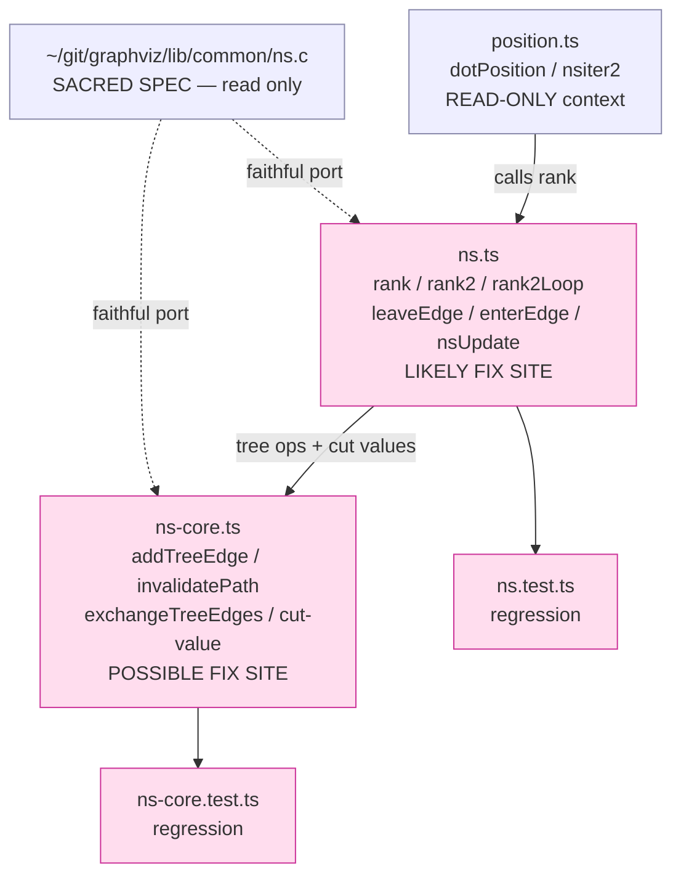

# Component map — touched modules

- **Write-set:** `ns.ts`, `ns-core.ts`, their tests.
- **Read-only:** `position.ts` (caller), `ns.c` (C spec, sacred).
- Fix site confirmed in Batch 2; `ns.ts` (pivot selection) is the prime suspect,
  `ns-core.ts` (cut-value / low-lim maintenance) the secondary.
