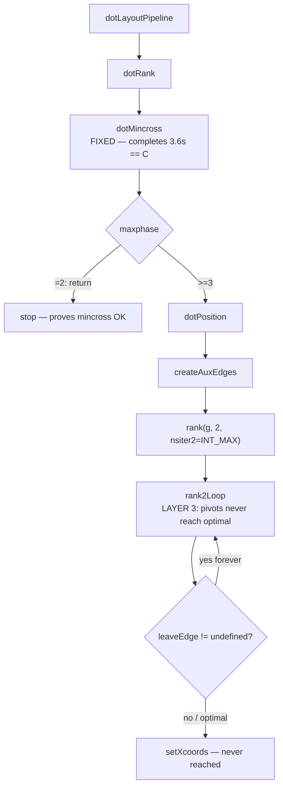
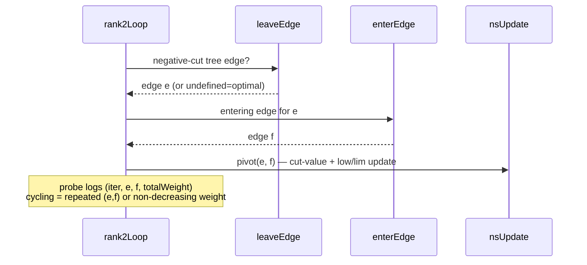
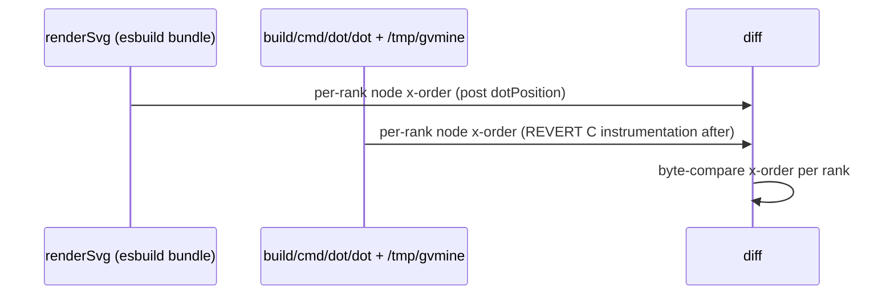

# Data flow — position → network simplex + diagnosis checkpoints

The hang is in `dotPosition`'s x-coord network simplex, after mincross (now
correct). `maxphase=2` stops before this; `maxphase=3` enters it and hangs.

## Pivot-cycling probe (Batch 1)

## C-oracle comparison (Batch 1/3)

