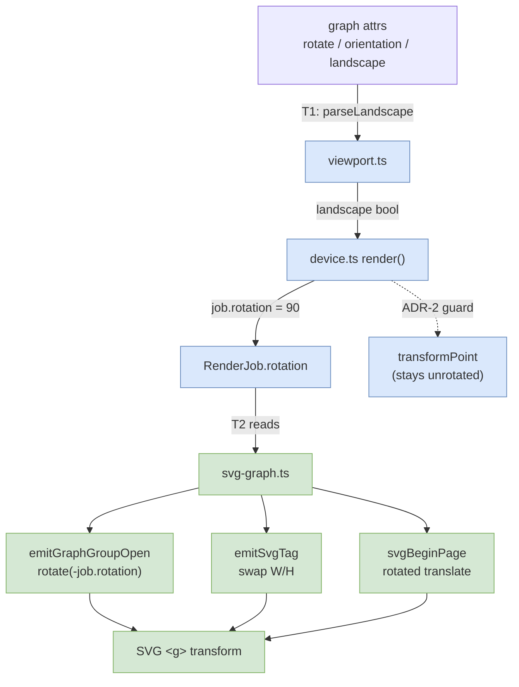

<!-- SPDX-License-Identifier: EPL-2.0 -->
# Component map — orientation=land

**Untouched (emit-only invariant):** `src/layout/**`, `src/pathplan/**`, splines.
Inner node/edge coordinates pass through `transformPoint` unrotated; the rotation
lives entirely in the SVG group transform.
