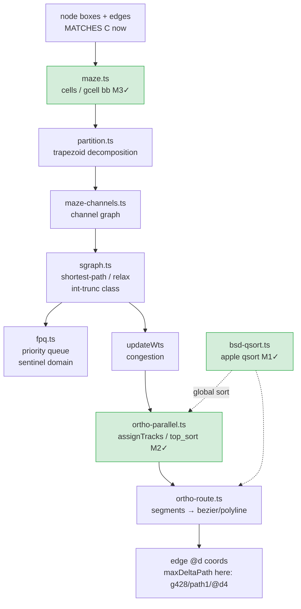

<!-- SPDX-License-Identifier: EPL-2.0 -->
# Component map — ortho edge-routing pipeline (2620 residual locus)

The maze INPUT now matches C (mincross fixed). The residual lives somewhere in
the stages below; T1 bisects to the first divergent one.

Green = already-landed fixes (M1 qsort, M2 addPEdges/tracks, M3 gcell bb) —
the residual is DISTINCT from these. Prime suspects for a fourth mechanism:
sgraph relax ordering/truncation, fPQ tie ordering, route-conversion segment
order, or a channel-graph tie-break. `maxDeltaPath` lands in ROUTE output.
