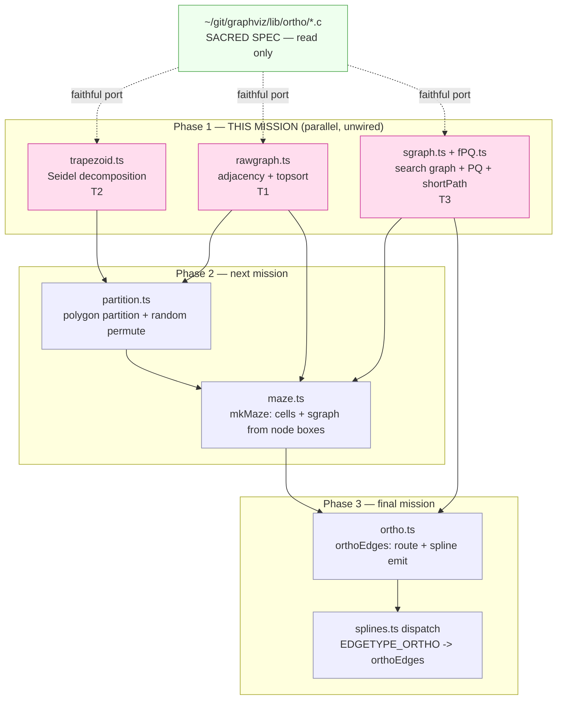

# Component map — ortho subsystem (P1 slice highlighted)

- **Write-set (P1):** `src/ortho/{rawgraph,trapezoid,sgraph,fPQ}.ts` + tests.
- **Read-only:** `~/git/graphviz/lib/ortho/*` (C spec), existing TS `pointf`.
- P1 has **no edge** into the layout pipeline — it cannot change rendered output
  (ADR-4). Wiring is P3 (`splines.ts` EDGETYPE_ORTHO dispatch, `dotsplines.c:251`).
