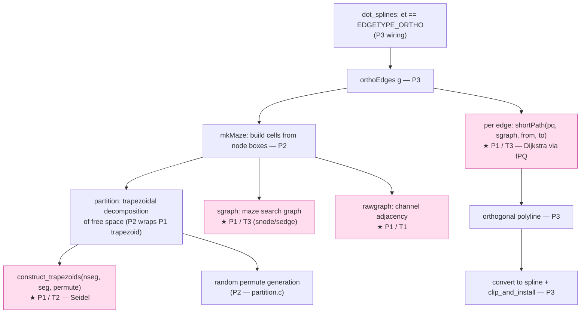

# Data flow — eventual ortho pipeline, and where P1 sits

The full `splines=ortho` pipeline (C `ortho.c:orthoEdges`). P1 ports the shaded
foundation; P2/P3 build the rest. P1 is verified in isolation against the C oracle.



## P1 verification flow (isolated, C-oracle)

```mermaid
sequenceDiagram
  participant C as instrumented lib/ortho (native)
  participant F as fixtures (segments / edge sets / sgraphs)
  participant TS as src/ortho/*.ts (port)
  participant T as vitest
  C->>T: dump traps_t (normalized), rawgraph adj+topsort,<br/>PQ pop seq, shortPath n_dad chain
  Note over C: build via make gvplugin_dot_layout → /tmp/gvmine; REVERT C after
  F->>TS: same fixture inputs (+ fixed permute for trapezoid)
  TS->>T: ported outputs
  T->>T: assert TS == C dump (byte / order-normalized)
```
