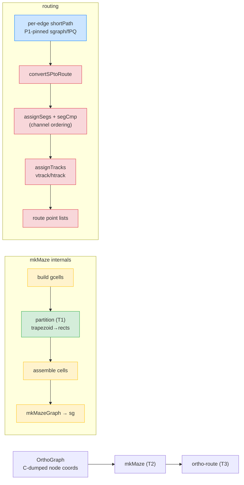

# Ortho render pipeline — what P2 pins

**Validation order (ADR-3, bottom-up):** T1 partition → T2 maze → T3 route.
Blue = already pinned (ortho-P1). Each stage is dumped from instrumented native
`dot` via gvmine and pinned in TS, driven by C-dumped node positions (ADR-2).
`segCmp` channel ordering (T3) is the load-bearing hot spot.
