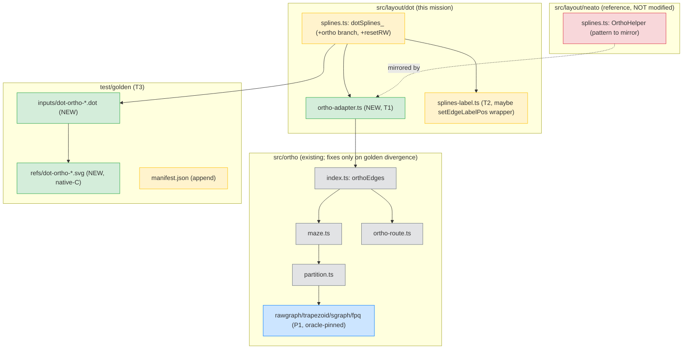

# Component map — affected components

**Legend:** green = new · yellow = modified · grey = existing (touched only on
golden divergence) · blue = P1 oracle-pinned · red = reference only (not modified).
