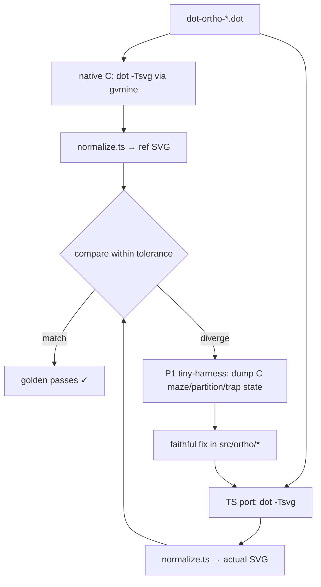

# Data flow — splines=ortho under the dot engine

## Dispatch (the gap this mission closes)

```mermaid
sequenceDiagram
    participant DS as dotSplines_(g)
    participant ADP as ortho-adapter (dot-local, T1)
    participant OE as orthoEdges (src/ortho)
    participant PIPE as maze→partition→sgraph/trapezoid→ortho-route
    participant E as Edge.info.spl

    DS->>DS: edgeType(g) == EDGETYPE_ORTHO ?
    alt ortho (NEW branch, mirrors dotsplines.c:251-259)
        DS->>DS: resetRW(g)
        opt has EDGE_LABEL (T2)
            DS->>DS: setEdgeLabelPos(g)  %% position only — C never routes around
        end
        DS->>ADP: buildOrthoGraph(g)
        ADP-->>DS: OrthoGraph
        DS->>OE: orthoEdges(og, useLbls, installCb)
        OE->>OE: if useLbls: warn + downgrade (ortho.c:1196)
        OE->>PIPE: route all edges
        PIPE->>ADP: installCb(oe, pts)
        ADP->>E: clipAndInstall → Edge.info.spl
        DS->>DS: edgeLabelsDone=true; skip routesplinesterm; return 0
    else non-ortho (UNCHANGED)
        DS->>DS: markLowclusters → routeEdgeGroup → routeDotEdges ...
    end
```

## Validation loop (T3)


