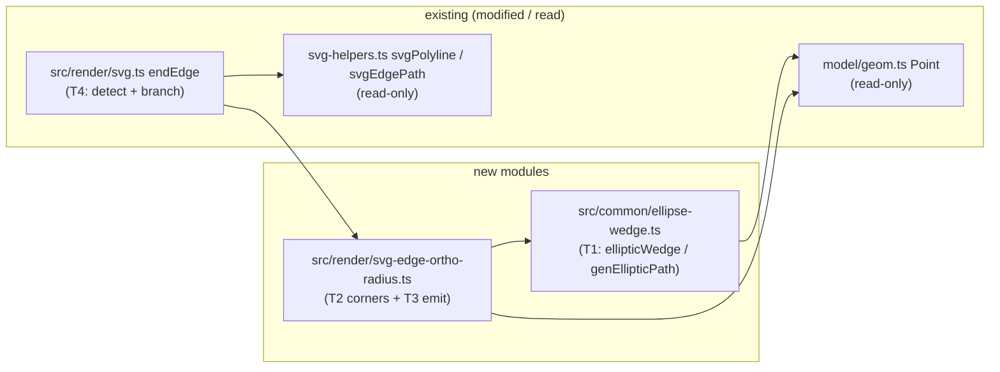

# Component map

```mermaid
graph LR
  subgraph new["new modules"]
    EW["src/common/ellipse-wedge.ts<br/>(T1: ellipticWedge / genEllipticPath)"]
    OR["src/render/svg-edge-ortho-radius.ts<br/>(T2 corners + T3 emit)"]
  end
  subgraph existing["existing (modified / read)"]
    SVG["src/render/svg.ts endEdge<br/>(T4: detect + branch)"]
    HLP["svg-helpers.ts svgPolyline / svgEdgePath<br/>(read-only)"]
    GEOM["model/geom.ts Point<br/>(read-only)"]
  end
  OR --> EW
  SVG --> OR
  SVG --> HLP
  EW --> GEOM
  OR --> GEOM
```

C sources mirrored: `lib/common/ellipse.c` (→ EW), `lib/common/emit.c`
2130-2330 + 2550-2666 (→ OR + the SVG branch).
