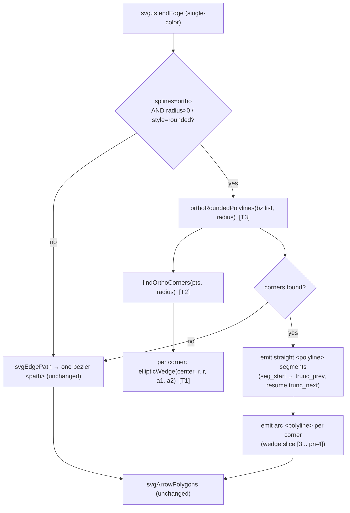

# Data flow — ortho rounded-corner emit

```mermaid
flowchart TD
  A["svg.ts endEdge (single-color)"] --> B{splines=ortho<br/>AND radius>0 / style=rounded?}
  B -- no --> P["svgEdgePath → one bezier &lt;path&gt; (unchanged)"]
  B -- yes --> C["orthoRoundedPolylines(bz.list, radius)  [T3]"]
  C --> D["findOrthoCorners(pts, radius)  [T2]"]
  D --> E["per corner: ellipticWedge(center, r, r, a1, a2)  [T1]"]
  C --> F{corners found?}
  F -- no --> P
  F -- yes --> G["emit straight &lt;polyline&gt; segments<br/>(seg_start → trunc_prev, resume trunc_next)"]
  G --> H["emit arc &lt;polyline&gt; per corner<br/>(wedge slice [3 .. pn-4])"]
  H --> I["svgArrowPolygons (unchanged)"]
  P --> I
```

The routing (spline corner points on `e.info.spl`) is already correct; this
pipeline only changes how those points are *drawn* for ortho+radius edges.
