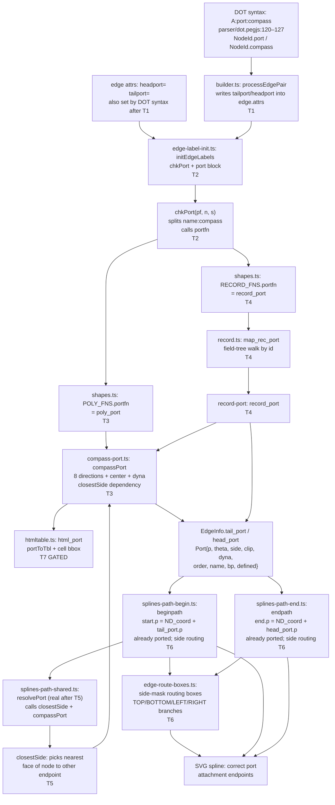

# Component map — edge-port attachment

```mermaid
graph TD
  DOT_SYN["DOT syntax: A:port:compass<br/>parser/dot.pegjs:120–127<br/>NodeId.port / NodeId.compass"]
  DOT_ATTR["edge attrs: headport= tailport=<br/>also set by DOT syntax after T1"]
  BUILDER["builder.ts: processEdgePair<br/>writes tailport/headport into edge.attrs<br/>T1"]
  INIT["edge-label-init.ts: initEdgeLabels<br/>chkPort + port block<br/>T2"]
  CHKPORT["chkPort(pf, n, s)<br/>splits name:compass<br/>calls portfn<br/>T2"]
  PORTFN_POLY["shapes.ts: POLY_FNS.portfn<br/>= poly_port<br/>T3"]
  PORTFN_REC["shapes.ts: RECORD_FNS.portfn<br/>= record_port<br/>T4"]
  COMPASS["compass-port.ts: compassPort<br/>8 directions + center + dyna<br/>closestSide dependency<br/>T3"]
  MAP_REC["record.ts: map_rec_port<br/>field-tree walk by id<br/>T4"]
  RECORD_PORT["record-port: record_port<br/>T4"]
  HTML_PORT["htmltable.ts: html_port<br/>portToTbl + cell bbox<br/>T7 GATED"]
  EDGEINFO["EdgeInfo.tail_port / head_port<br/>Port{p, theta, side, clip, dyna,<br/>order, name, bp, defined}"]
  RESOLVE["splines-path-shared.ts:<br/>resolvePort (real after T5)<br/>calls closestSide + compassPort"]
  CLOSEST["closestSide: picks nearest<br/>face of node to other endpoint<br/>T5"]
  BEGIN["splines-path-begin.ts:<br/>beginpath<br/>start.p = ND_coord + tail_port.p<br/>already ported; side routing T6"]
  END_PATH["splines-path-end.ts:<br/>endpath<br/>end.p = ND_coord + head_port.p<br/>already ported; side routing T6"]
  ROUTE_BOX["edge-route-boxes.ts:<br/>side-mask routing boxes<br/>TOP/BOTTOM/LEFT/RIGHT branches<br/>T6"]
  SVG["SVG spline: correct port<br/>attachment endpoints"]

  DOT_SYN --> BUILDER
  DOT_ATTR --> INIT
  BUILDER --> INIT
  INIT --> CHKPORT
  CHKPORT --> PORTFN_POLY --> COMPASS
  CHKPORT --> PORTFN_REC --> MAP_REC --> RECORD_PORT --> COMPASS
  COMPASS --> HTML_PORT
  COMPASS --> EDGEINFO
  RECORD_PORT --> EDGEINFO
  EDGEINFO --> BEGIN
  EDGEINFO --> END_PATH
  BEGIN --> RESOLVE --> CLOSEST --> COMPASS
  BEGIN --> ROUTE_BOX
  END_PATH --> ROUTE_BOX
  ROUTE_BOX --> SVG
  BEGIN --> SVG
  END_PATH --> SVG
```
