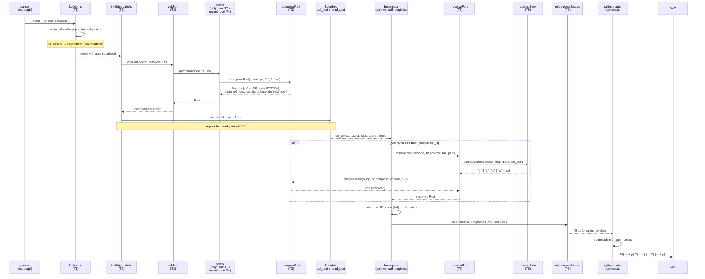

# Data-flow — port resolution → spline endpoint

## Port struct fields set at each stage

| Stage | Fields set |
|-------|-----------|
| T2 `chkPort` | `name` |
| T3 `compassPort` | `p`, `theta`, `side`, `clip`, `dyna`, `defined`, `constrained`, `bp` |
| T4 `record_port` | `bp` (field bbox value copy) → then compassPort fills rest |
| T5 `resolvePort` | re-runs compassPort; `name` preserved |
| T6 `beginpath` | reads `p`, `side`, `constrained`, `theta`, `dyna`, `clip` |
