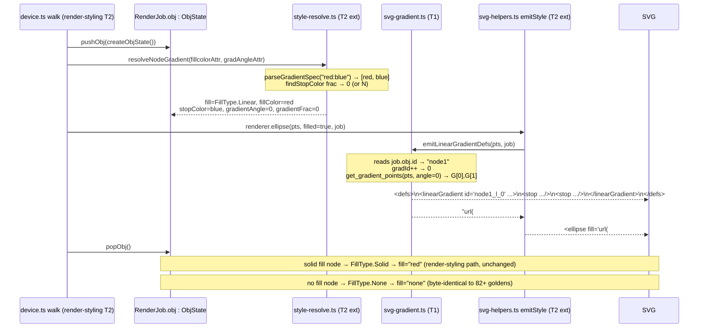

# Data flow — gradient-filled node, attrs to SVG

```mermaid
sequenceDiagram
  participant Walk as device.ts walk (render-styling T2)
  participant Job as RenderJob.obj : ObjState
  participant Res as style-resolve.ts (T2 ext)
  participant Grad as svg-gradient.ts (T1)
  participant Emit as svg-helpers.ts emitStyle (T2 ext)
  participant SVG

  Walk->>Job: pushObj(createObjState())
  Walk->>Res: resolveNodeGradient(fillcolorAttr, gradAngleAttr)
  Note over Res: parseGradientSpec("red:blue") → [red, blue]<br/>findStopColor frac → 0 (or N)
  Res-->>Job: fill=FillType.Linear, fillColor=red<br/>stopColor=blue, gradientAngle=0, gradientFrac=0
  Walk->>Emit: renderer.ellipse(pts, filled=true, job)

  Emit->>Grad: emitLinearGradientDefs(pts, job)
  Note over Grad: reads job.obj.id → "node1"<br/>gradId++ → 0<br/>get_gradient_points(pts, angle=0) → G[0],G[1]
  Grad-->>SVG: <defs>\n<linearGradient id="node1_l_0" ...>\n<stop .../>\n<stop .../>\n</linearGradient>\n</defs>
  Grad-->>Emit: "url(#node1_l_0)"

  Emit-->>SVG: <ellipse fill="url(#node1_l_0)" stroke="black" .../>

  Walk->>Job: popObj()

  Note over Job,SVG: solid fill node → FillType.Solid → fill="red" (render-styling path, unchanged)
  Note over Job,SVG: no fill node → FillType.None → fill="none" (byte-identical to 82+ goldens)
```
