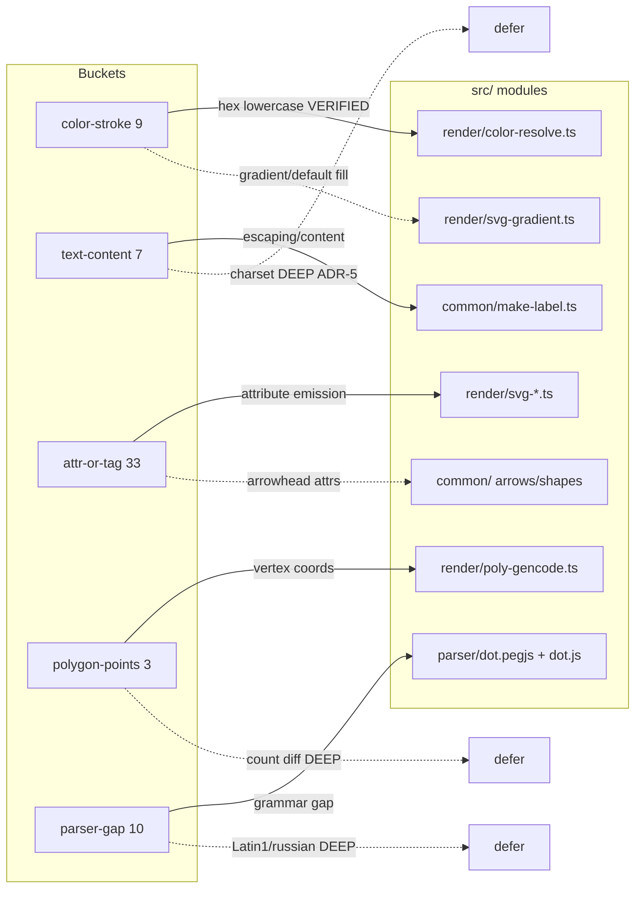

# Component map — buckets over modules

Which `src/` modules each bucket's fixes most likely touch (finalized per triage).

Solid = likely-simple (in scope). Dashed-to-defer = presumed deep (comparison
page). Modules are a planning estimate; each fix task finalizes its write-set
from the triage doc.
