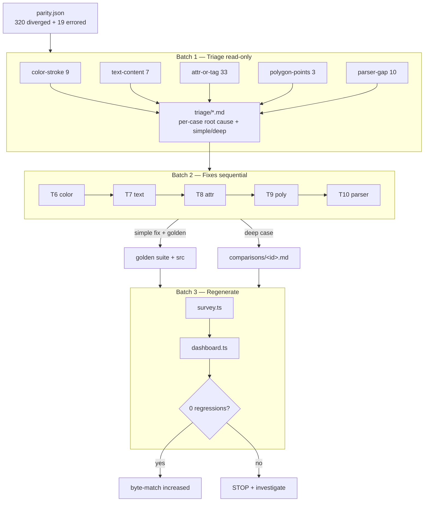
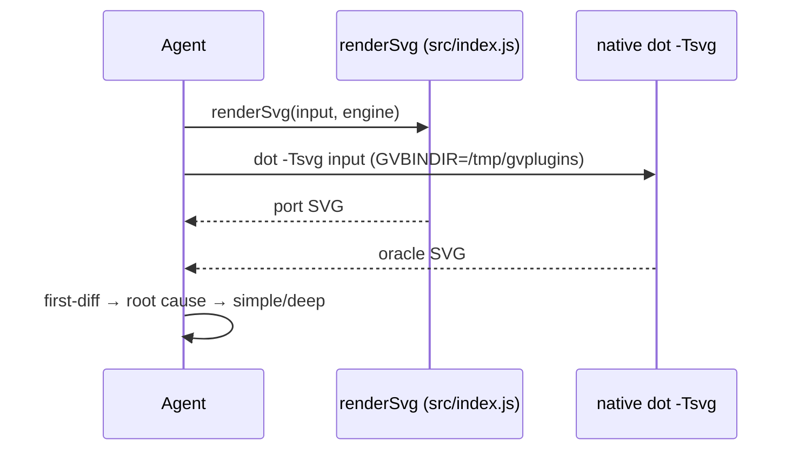

# Data flow — triage → fix → regenerate

## Oracle render (each triage/fix step)

> Probe scripts: write the `.mjs` at the REPO ROOT (not `/tmp`) — relative
> `./src/*.js` imports only resolve from the repo root.
