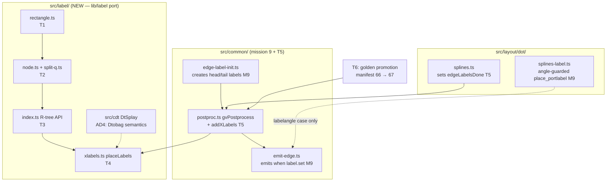

# Component map — mission 10

```mermaid
graph TD
    subgraph "src/label/ (NEW — lib/label port)"
        RECT[rectangle.ts<br/>T1] --> NODE[node.ts + split-q.ts<br/>T2]
        NODE --> RIDX[index.ts R-tree API<br/>T3]
        RIDX --> XL[xlabels.ts placeLabels<br/>T4]
        CDT[src/cdt DtSplay<br/>AD4: Dtobag semantics] -.-> XL
    end

    subgraph "src/common/ (mission 9 + T5)"
        ELI[edge-label-init.ts<br/>creates head/tail labels M9] --> PP
        PP[postproc.ts gvPostprocess<br/>+ addXLabels T5] --> XL
        PP --> EMIT[emit-edge.ts<br/>emits when label.set M9]
    end

    subgraph "src/layout/dot/"
        SPL[splines.ts<br/>sets edgeLabelsDone T5] --> PP
        SLB[splines-label.ts<br/>angle-guarded place_portlabel M9] -.->|labelangle case only| EMIT
    end

    T6[T6: golden promotion<br/>manifest 66 → 67] --> PP
```
