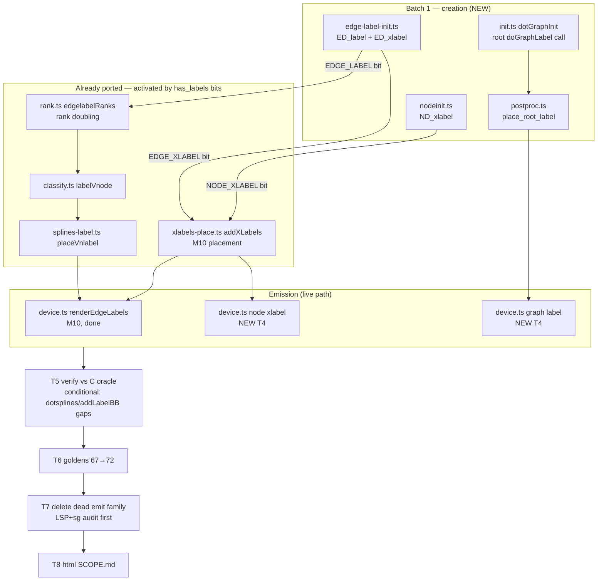

# Component map — mission 11

```mermaid
graph TD
    subgraph creation["Batch 1 — creation (NEW)"]
        T1[nodeinit.ts<br/>ND_xlabel]
        T2[edge-label-init.ts<br/>ED_label + ED_xlabel]
        T3a[init.ts dotGraphInit<br/>root doGraphLabel call]
        T3b[postproc.ts<br/>place_root_label]
    end

    subgraph dormant["Already ported — activated by has_labels bits"]
        ER[rank.ts edgelabelRanks<br/>rank doubling]
        CV[classify.ts labelVnode]
        PV[splines-label.ts placeVnlabel]
        AX[xlabels-place.ts addXLabels<br/>M10 placement]
    end

    subgraph emission["Emission (live path)"]
        REL[device.ts renderEdgeLabels<br/>M10, done]
        T4a[device.ts node xlabel<br/>NEW T4]
        T4b[device.ts graph label<br/>NEW T4]
    end

    T2 -->|EDGE_LABEL bit| ER --> CV --> PV --> REL
    T2 -->|EDGE_XLABEL bit| AX --> REL
    T1 -->|NODE_XLABEL bit| AX --> T4a
    T3a --> T3b --> T4b

    T5[T5 verify vs C oracle<br/>conditional: dotsplines/addLabelBB gaps]
    T6[T6 goldens 67→72]
    T7[T7 delete dead emit family<br/>LSP+sg audit first]
    T8[T8 html SCOPE.md]
    emission --> T5 --> T6 --> T7 --> T8
```
