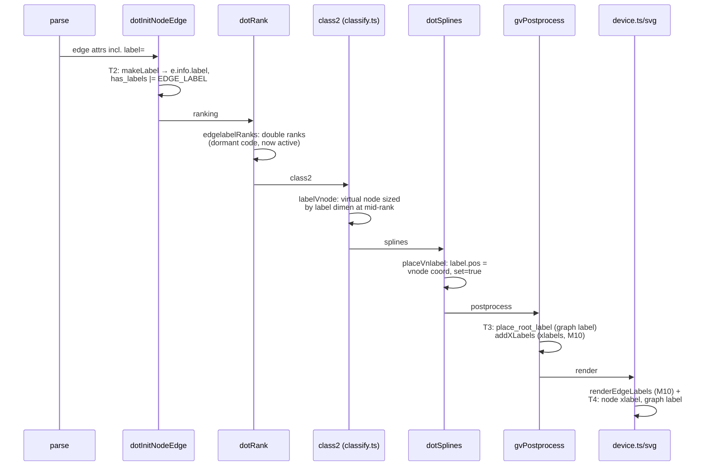

# Data flow — edge label= through the dot pipeline (mission 11 target)

```mermaid
sequenceDiagram
    participant P as parse
    participant I as dotInitNodeEdge
    participant R as dotRank
    participant C as class2 (classify.ts)
    participant S as dotSplines
    participant PP as gvPostprocess
    participant D as device.ts/svg

    P->>I: edge attrs incl. label=
    I->>I: T2: makeLabel → e.info.label,<br/>has_labels |= EDGE_LABEL
    I->>R: ranking
    R->>R: edgelabelRanks: double ranks<br/>(dormant code, now active)
    R->>C: class2
    C->>C: labelVnode: virtual node sized<br/>by label dimen at mid-rank
    C->>S: splines
    S->>S: placeVnlabel: label.pos =<br/>vnode coord, set=true
    S->>PP: postprocess
    PP->>PP: T3: place_root_label (graph label)<br/>addXLabels (xlabels, M10)
    PP->>D: render
    D->>D: renderEdgeLabels (M10) +<br/>T4: node xlabel, graph label
```
