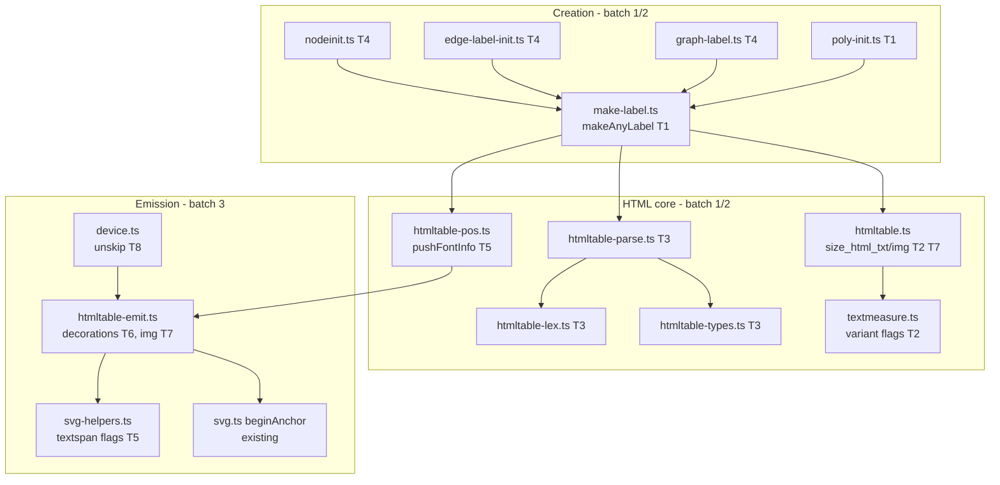
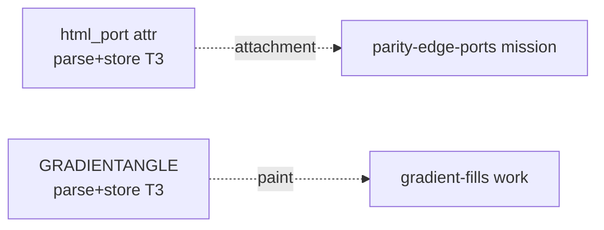

# Component map — html label parity

```mermaid
graph TD
  subgraph creation [Creation - batch 1/2]
    MAL[make-label.ts<br/>makeAnyLabel T1]
    NI[nodeinit.ts T4]
    ELI[edge-label-init.ts T4]
    GL[graph-label.ts T4]
    PI[poly-init.ts T1]
    NI --> MAL
    ELI --> MAL
    GL --> MAL
    PI --> MAL
  end

  subgraph htmlcore [HTML core - batch 1/2]
    LEX[htmltable-lex.ts T3]
    PARSE[htmltable-parse.ts T3]
    TYPES[htmltable-types.ts T3]
    SIZE[htmltable.ts<br/>size_html_txt/img T2 T7]
    POS[htmltable-pos.ts<br/>pushFontInfo T5]
    MEAS[textmeasure.ts<br/>variant flags T2]
    MAL --> PARSE
    PARSE --> LEX
    PARSE --> TYPES
    MAL --> SIZE
    SIZE --> MEAS
    MAL --> POS
  end

  subgraph emission [Emission - batch 3]
    EMIT[htmltable-emit.ts<br/>decorations T6, img T7]
    DEV[device.ts<br/>unskip T8]
    SVGH[svg-helpers.ts<br/>textspan flags T5]
    SVGR[svg.ts beginAnchor<br/>existing]
    DEV --> EMIT
    EMIT --> SVGH
    EMIT --> SVGR
  end

  POS --> EMIT
```

Deferred dependencies (exceptions AD4/AD6):

```mermaid
graph LR
  HP[html_port attr<br/>parse+store T3] -.attachment.-> EP[parity-edge-ports mission]
  GA[GRADIENTANGLE<br/>parse+store T3] -.paint.-> GF[gradient-fills work]
```
