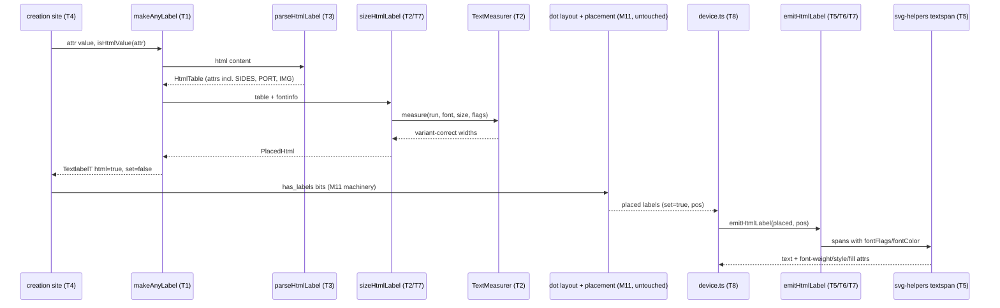

# Data flow — html label, creation to SVG

```mermaid
sequenceDiagram
  participant Init as creation site (T4)
  participant MAL as makeAnyLabel (T1)
  participant Parse as parseHtmlLabel (T3)
  participant Size as sizeHtmlLabel (T2/T7)
  participant Meas as TextMeasurer (T2)
  participant Layout as dot layout + placement (M11, untouched)
  participant Dev as device.ts (T8)
  participant Emit as emitHtmlLabel (T5/T6/T7)
  participant SVG as svg-helpers textspan (T5)

  Init->>MAL: attr value, isHtmlValue(attr)
  MAL->>Parse: html content
  Parse-->>MAL: HtmlTable (attrs incl. SIDES, PORT, IMG)
  MAL->>Size: table + fontinfo
  Size->>Meas: measure(run, font, size, flags)
  Meas-->>Size: variant-correct widths
  Size-->>MAL: PlacedHtml
  MAL-->>Init: TextlabelT html=true, set=false
  Init->>Layout: has_labels bits (M11 machinery)
  Layout-->>Dev: placed labels (set=true, pos)
  Dev->>Emit: emitHtmlLabel(placed, pos)
  Emit->>SVG: spans with fontFlags/fontColor
  SVG-->>Dev: text + font-weight/style/fill attrs
```
