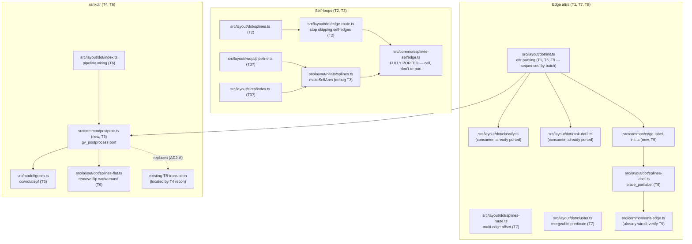

# Component map — what each cluster touches

```mermaid
graph TD
  subgraph cluster_attrs["Edge attrs (T1, T7, T9)"]
    init["src/layout/dot/init.ts<br/>attr parsing (T1, T6, T9 — sequenced by batch)"]
    classify["src/layout/dot/classify.ts<br/>(consumer, already ported)"]
    rank2["src/layout/dot/rank-dot2.ts<br/>(consumer, already ported)"]
    sroute["src/layout/dot/splines-route.ts<br/>multi-edge offset (T7)"]
    clu["src/layout/dot/cluster.ts<br/>mergeable predicate (T7)"]
    eli["src/common/edge-label-init.ts (new, T9)"]
    slabel["src/layout/dot/splines-label.ts<br/>place_portlabel (T9)"]
    emit["src/common/emit-edge.ts<br/>(already wired, verify T9)"]
  end

  subgraph cluster_self["Self-loops (T2, T3)"]
    selfmod["src/common/splines-selfedge.ts<br/>FULLY PORTED — call, don't re-port"]
    eroute["src/layout/dot/edge-route.ts<br/>stop skipping self-edges (T2)"]
    dsplines["src/layout/dot/splines.ts (T2)"]
    nsplines["src/layout/neato/splines.ts<br/>makeSelfArcs (debug T3)"]
    twopi["src/layout/twopi/pipeline.ts (T3?)"]
    circo["src/layout/circo/index.ts (T3?)"]
  end

  subgraph cluster_rankdir["rankdir (T4, T6)"]
    postproc["src/common/postproc.ts (new, T6)<br/>gv_postprocess port"]
    geom["src/model/geom.ts<br/>ccwrotatepf (T6)"]
    dindex["src/layout/dot/index.ts<br/>pipeline wiring (T6)"]
    sflat["src/layout/dot/splines-flat.ts<br/>remove flip workaround (T6)"]
    existing["existing TB translation<br/>(located by T4 recon)"]
  end

  init --> classify
  init --> rank2
  init --> eli
  eli --> slabel
  slabel --> emit
  eroute --> selfmod
  dsplines --> eroute
  nsplines --> selfmod
  twopi --> nsplines
  circo --> nsplines
  init --> postproc
  postproc --> geom
  dindex --> postproc
  postproc -. replaces (AD2-A) .-> existing
  postproc --> sflat
```
