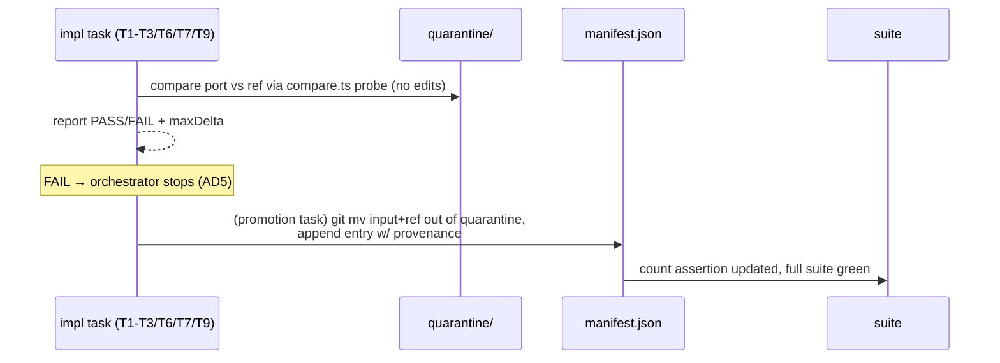

# Data flow — rankdir postprocess (the riskiest change, T6)

```mermaid
sequenceDiagram
    participant P as parser/builder
    participant I as dot init (T1/T6/T9 additions)
    participant L as dot layout phases
    participant PP as postproc.ts (new, T6)
    participant E as emit/render

    P->>I: graph + attrs
    I->>I: parse rankdir → SET_RANKDIR bits, g.info.flip
    I->>I: parse minlen/constraint (T1), head/tail labels (T9)
    I->>L: nodes sized via gvNodesize(flip) [already ported]
    L->>L: rank / order / position / splines (all in TB space)
    L->>PP: gv_postprocess(g)
    PP->>PP: Offset per rankdir (postproc.c:657-672)
    PP->>PP: map_point = ccwrotate(p, rankdir*90) − Offset
    PP->>PP: translate_drawing: nodes, splines, labels;<br/>unswap sizes EXCEPT rankdir=BT
    PP->>E: coordinates in final space
    E->>E: SVG emission (byte-identical for TB — AD2 gate)
```

# Data flow — golden promotion (T5/T8/T10)


