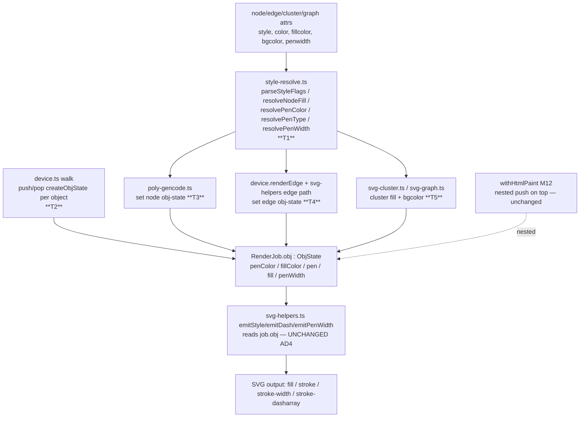

# Component map — render styling

```mermaid
graph TD
  ATTR[node/edge/cluster/graph attrs<br/>style, color, fillcolor, bgcolor, penwidth]
  T1[style-resolve.ts<br/>parseStyleFlags / resolveNodeFill /<br/>resolvePenColor / resolvePenType / resolvePenWidth<br/>**T1**]
  T2[device.ts walk<br/>push/pop createObjState per object<br/>**T2**]
  JOB[RenderJob.obj : ObjState<br/>penColor / fillColor / pen / fill / penWidth]
  T3[poly-gencode.ts<br/>set node obj-state **T3**]
  T4[device.renderEdge + svg-helpers edge path<br/>set edge obj-state **T4**]
  T5[svg-cluster.ts / svg-graph.ts<br/>cluster fill + bgcolor **T5**]
  EMIT[svg-helpers.ts emitStyle/emitDash/emitPenWidth<br/>reads job.obj — UNCHANGED AD4]
  SVG[SVG output: fill / stroke / stroke-width / stroke-dasharray]

  ATTR --> T1
  T2 --> JOB
  T1 --> T3 --> JOB
  T1 --> T4 --> JOB
  T1 --> T5 --> JOB
  JOB --> EMIT --> SVG
  HTML[withHtmlPaint M12<br/>nested push on top — unchanged] -.->|nested| JOB
```
