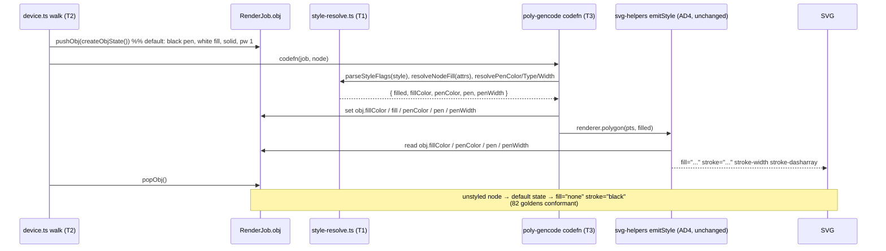

# Data flow — styled node, attrs to SVG

```mermaid
sequenceDiagram
  participant Walk as device.ts walk (T2)
  participant Job as RenderJob.obj
  participant Res as style-resolve.ts (T1)
  participant Code as poly-gencode codefn (T3)
  participant Emit as svg-helpers emitStyle (AD4, unchanged)
  participant SVG

  Walk->>Job: pushObj(createObjState())   %% default: black pen, white fill, solid, pw 1
  Walk->>Code: codefn(job, node)
  Code->>Res: parseStyleFlags(style), resolveNodeFill(attrs), resolvePenColor/Type/Width
  Res-->>Code: { filled, fillColor, penColor, pen, penWidth }
  Code->>Job: set obj.fillColor / fill / penColor / pen / penWidth
  Code->>Emit: renderer.polygon(pts, filled)
  Emit->>Job: read obj.fillColor / penColor / pen / penWidth
  Emit-->>SVG: fill="..." stroke="..." stroke-width stroke-dasharray
  Walk->>Job: popObj()
  Note over Job,SVG: unstyled node → default state → fill="none" stroke="black"<br/>(82 goldens conformant)
```
