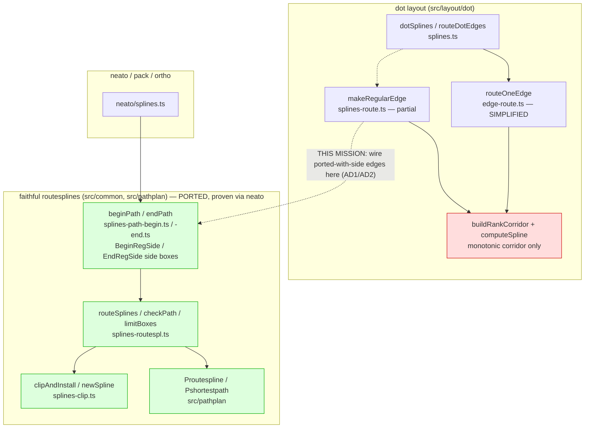

# Component map — steering-port routing

How dot routing relates to the faithful pipeline this mission wires in.

- Red: the simplified fitter that truncates loop corridors (the blocker).
- Green: the faithful pipeline, already ported and exercised by neato.
- Dashed mission arrow: route dot's side-port edges through `beginPath` →
  `routeSplines` → `clipAndInstall`, gated to ported-with-side edges first
  (AD2), full-switch decided in SR9 (AD3).
