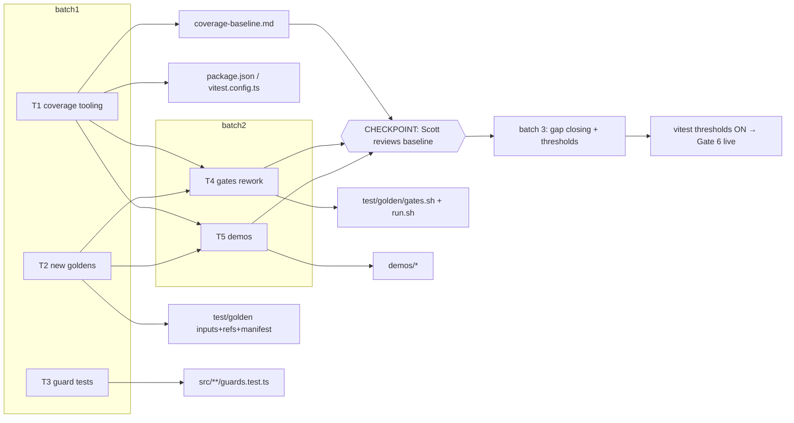

# Component map — what each task touches

```mermaid
graph LR
  subgraph batch1
    T1[T1 coverage tooling]
    T2[T2 new goldens]
    T3[T3 guard tests]
  end
  subgraph batch2
    T4[T4 gates rework]
    T5[T5 demos]
  end
  CP{{CHECKPOINT: Scott reviews baseline}}
  B3[batch 3: gap closing + thresholds]

  T1 --> PKG[package.json / vitest.config.ts]
  T1 --> BASE[coverage-baseline.md]
  T2 --> GOLD[test/golden inputs+refs+manifest]
  T3 --> GUARDS[src/**/guards.test.ts]
  T4 --> GATES[test/golden/gates.sh + run.sh]
  T5 --> DEMOS[demos/*]
  T1 --> T4
  T2 --> T4
  T1 --> T5
  T2 --> T5
  BASE --> CP
  T4 --> CP
  T5 --> CP
  CP --> B3
  B3 --> THRESH[vitest thresholds ON → Gate 6 live]
```
