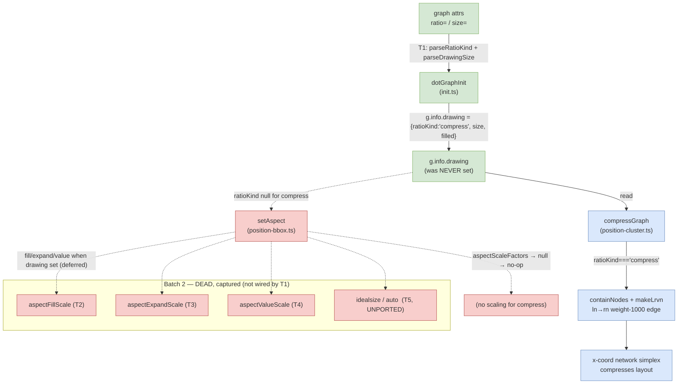

<!-- SPDX-License-Identifier: EPL-2.0 -->
# Component map — ratio=compress

**Legend:** green = T1 wiring (in scope) · blue = already-ported live machinery
that T1 switches on · red = dead/unported ratio-aspect code captured as Batch 2
tasks. The single root cause is the unpopulated `g.info.drawing`.
