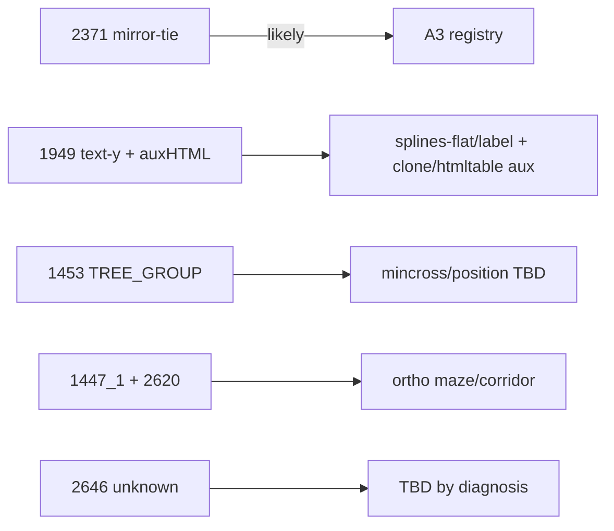

```mermaid
graph LR
  R1[2371 mirror-tie] -->|likely| REG[A3 registry]
  R2[1949 text-y + auxHTML] --> SF[splines-flat/label + clone/htmltable aux]
  R3[1453 TREE_GROUP] --> MP[mincross/position TBD]
  R4[1447_1 + 2620] --> ORTHO[ortho maze/corridor]
  R5[2646 unknown] --> TBD[TBD by diagnosis]
```
