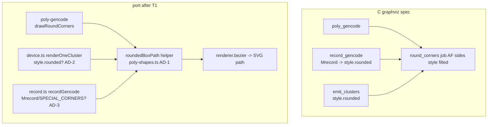
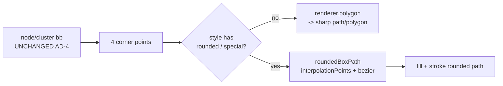

<!-- SPDX-License-Identifier: EPL-2.0 -->
# Data flow — rounded boundary dispatch

C draws every special-corner boundary through one `round_corners`; the port
gains a shared helper that the cluster and record sites call, mirroring it.

