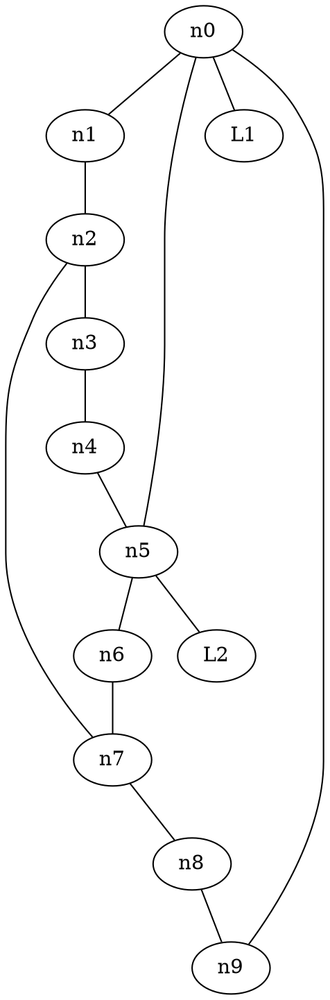

# Comparison — SFDP-1: beautify_leaves

## Input

(well-connected ring + 2 degree-1 leaves L1, L2 — oracle-stable to 6 digits)

## Oracle (sfdp 15.0.0)

Full-precision ND_pos via the sfdp-oracle C probe (`../sfdp-oracle.c`). The
12 node positions are listed in `../README.md`.

## Port (this branch)

`sfdpLayout` with `beautify=true` reproduces all 12 positions to **6
decimal digits** — verified by `spring-electrical.test.ts` →
"beautifyLeaves — sfdp oracle parity".

## Verdict

**MATCH** (6 digits, the existing sfdp test precision — V8 vs Apple libm
cos/sin differ by ~1 ULP). Before this mission `beautify=true` threw.
`beautify_leaves` runs per multilevel level; `set_leaves`'s
`cos(ang)·dist + base` / `sin(ang)·dist + base` are fused (`fma`) to match
the C binary's `fmadd` (disassembly-confirmed). Full suite 1860 passed,
zero golden churn (beautify is off by default).

## Note on testability

A bare star (`a--b; a--c; ...`) is NOT oracle-stable — chaotic FP symmetry
makes TS settle into a rotation/reflection-equivalent layout that diverges
~1e-3 from the oracle. This is a pre-existing sfdp FP sensitivity, NOT a
beautify bug; the test graph is deliberately well-connected.
