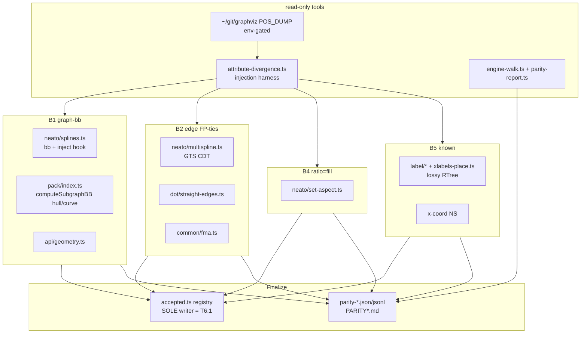

# Component map — what each bucket touches

Write-set isolation: B1→splines/pack/geometry, B2→multispline/straight-edges/fma,
B4→set-aspect, B5→label/x-coord-NS. Distinct src files per bucket → batches
1-5 run without write conflicts. The registry + parity docs have a single
writer (T6.1). B2 and B4 touch shared primitives (fma, set-aspect) used by
neato/fdp → their fixes require the cross-engine re-sweep in T6.1.
