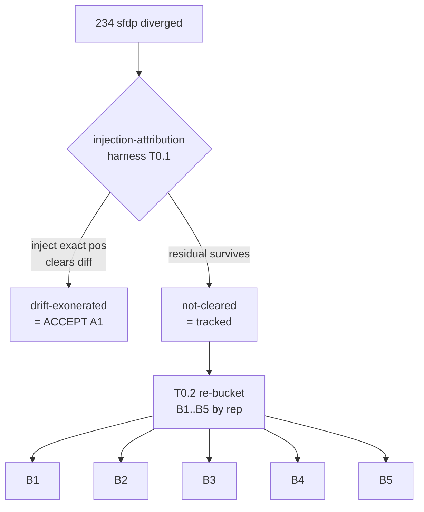
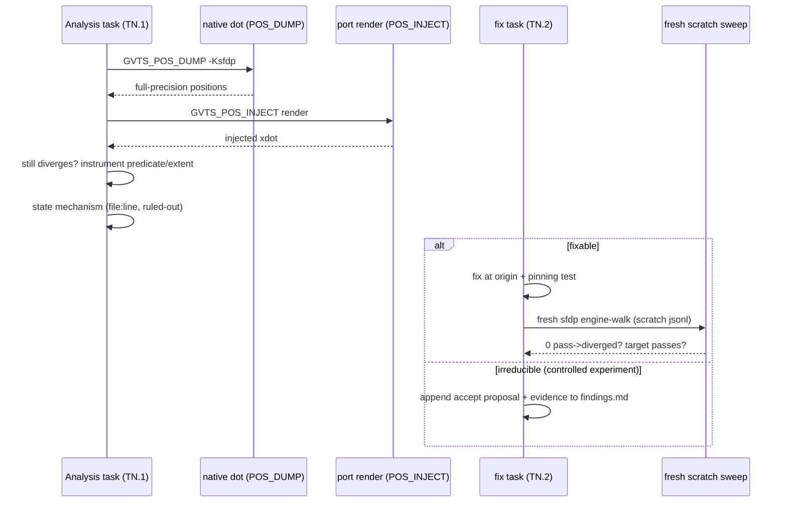
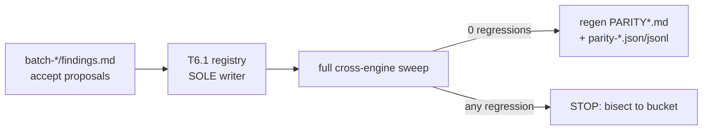

# Data flow — root-cause + solve/accept loop

## Mission 0: attribution regen re-splits the diverged set

## Per-bucket: analyze → fix-or-accept (diagnosis.md gate)

## Finalize: consolidate + prove

