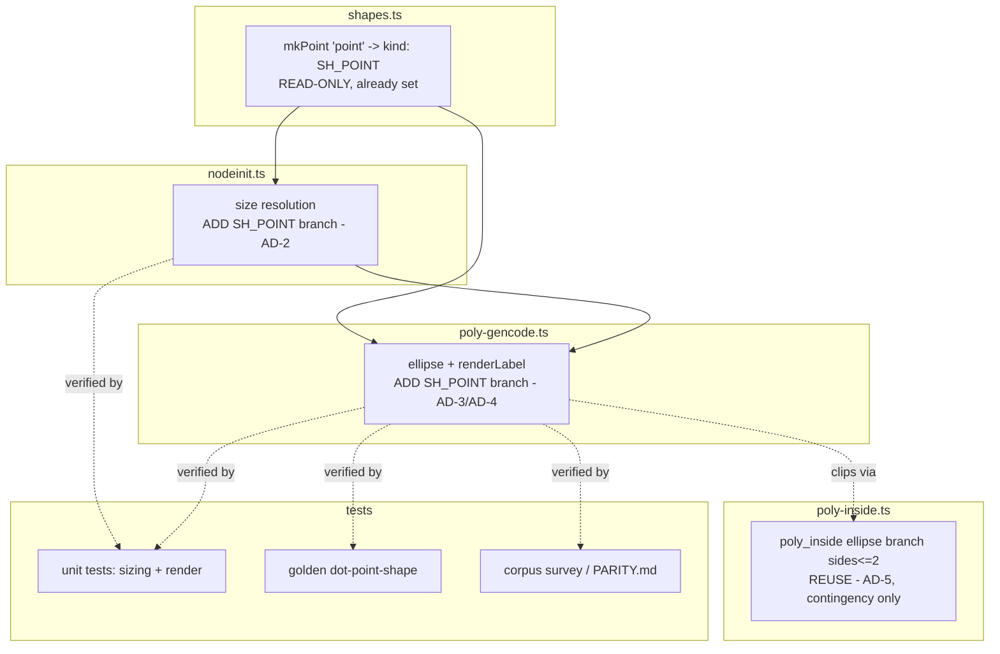

<!-- SPDX-License-Identifier: EPL-2.0 -->
# Component map

Write-set: `nodeinit.ts` (T1), `poly-gencode.ts` (T1), module tests (T1),
`poly-inside.ts` (T1, contingency only), goldens + parity (T2). `shapes.ts` and
the ellipse/inside paths are read-only/reuse dependencies.
