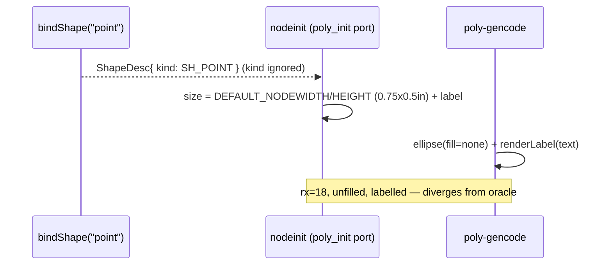

<!-- SPDX-License-Identifier: EPL-2.0 -->
# Data flow — shape=point, before vs after

## Before (treated as default ellipse)



## After (SH_POINT branch)

```mermaid
sequenceDiagram
    participant B as bindShape("point")
    participant N as nodeinit (poly_init port)
    participant G as poly-gencode
    B-->>N: ShapeDesc{ kind: SH_POINT }
    alt kind == SH_POINT (AD-2)
        N->>N: w = min(width,height) attrs; default DEF_POINT(0.05); clamp MIN_POINT
        N->>N: width = height = w  (label NOT a size input)
    end
    alt kind == SH_POINT (AD-3, AD-4)
        G->>G: ellipse(filled=true, fill=findFillDflt(n,"black"))
        G->>G: SKIP renderLabel
    end
    Note over N,G: rx=1.8, filled black, no label — byte-matches oracle
```
