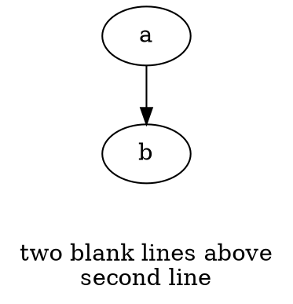

<!-- SPDX-License-Identifier: EPL-2.0 -->

# T1 — Empty-label-span guard

## Context

`graphviz-ts` is a faithful TypeScript port of Graphviz; the C source at
`~/git/graphviz` is the spec. When emitting a multi-line label, the port emits
one `<text>` element per line **including blank lines**, producing empty
`<text></text>` elements. The native oracle emits a text element only for
non-empty lines, while still reserving the vertical space. This is the
`childCount` first-diff on the `rankdir_dot*` rows (label
`"\n\n\n\nObject Oriented Graphs\nStephen North, 3/19/93"` → port emits 4 extra
empty `<text>`).

## Task

In `renderOneLabel` (`src/gvc/device.ts:215`), guard the
`renderer.textspan(...)` call so it fires **only for non-empty spans**, exactly
as C's `gvrender_textspan` does:

```c
// lib/gvc/gvrender.c:419
if (span->str && span->str[0] && (!job->obj || job->obj->pen != PEN_NONE)) {
    ... gvre->textspan(job, PF, span);
}
```

The `y -= span.size.y` baseline advance (line 235) must remain **unconditional**
— only the device call is guarded. Port the empty-string check
(`span.str.length > 0`). The pen≠NONE clause: replicate faithfully if the job
pen is readily available on the port's `RenderJob`/obj; if it is not modeled,
the string check alone resolves these cases — note the omission in a code
comment and the decision journal rather than inventing pen plumbing.

## Write-set

- `src/gvc/device.ts` — `renderOneLabel` only (do not touch `render()` at
  line 442; that is T2's).
- `test/golden/inputs/dot-label-blank-lines.dot` — new minimal input.
- `test/golden/refs/dot-label-blank-lines.svg` — oracle reference (generate, see
  Quality bar).
- `test/golden/manifest.json` — append one entry.

## Read-set

- `src/gvc/device.ts:200-237` (`labelSpanX`, `renderOneLabel`, `labelFirstSpanY`)
- `src/common/emit-types.ts:84-90` (`TextSpan.str`)
- `~/git/graphviz/lib/gvc/gvrender.c:414-431` (`gvrender_textspan`)
- `test/golden/manifest.json:1-20` (entry shape)

## Architecture decisions

- None specific. General port rule: preserve C order/branches
  (`CLAUDE.md` — The C Source Is Sacred).

## Interface contracts

None consumed downstream. Self-contained.

## Acceptance criteria

- Given a node/graph label with one or more blank lines, when rendered to SVG,
  then **no empty `<text></text>` element is emitted** for the blank lines.
- Given that same label, when rendered, then the non-empty lines appear at the
  **same `y` baselines** as before this change (blank lines still consume
  vertical space — the `y` advance is unconditional).
- Given a single-line non-empty label, when rendered, then output is
  **byte-identical** to before (no-op for the common case).
- Given the new golden `dot-label-blank-lines`, when `vitest run` executes the
  golden suite, then it passes within the `deterministic` tolerance.

## Golden construction

Minimal input exercising a leading blank line, e.g.:



Generate the reference with the same oracle the corpus uses:
`~/git/graphviz/build/cmd/dot/dot -Tsvg <input> > refs/dot-label-blank-lines.svg`
(env `GVBINDIR=/tmp/gvplugins`). Confirm the oracle ref contains **no** empty
`<text>` element. Add the manifest entry (`engine: dot`, `toleranceClass:
deterministic`).

## Observability

N/A — no new observable operations (pure render-path correctness fix).

## Rollback

**Reversible** — revert the commit; no data/schema/API change.

## Quality bar

`npx tsc --noEmit --stableTypeOrdering` clean; `npx vitest run` green including
the new golden. Commit: `fix(T1): skip empty label spans in renderOneLabel`.
Body: reference `gvrender.c:419` and the rankdir childCount divergence.

## Boundaries

- **Never:** modify the `y -= span.size.y` advance condition; touch `render()`
  / `init_job_viewport` (T2 owns it); add pen plumbing that does not already
  exist (note the omission instead).
