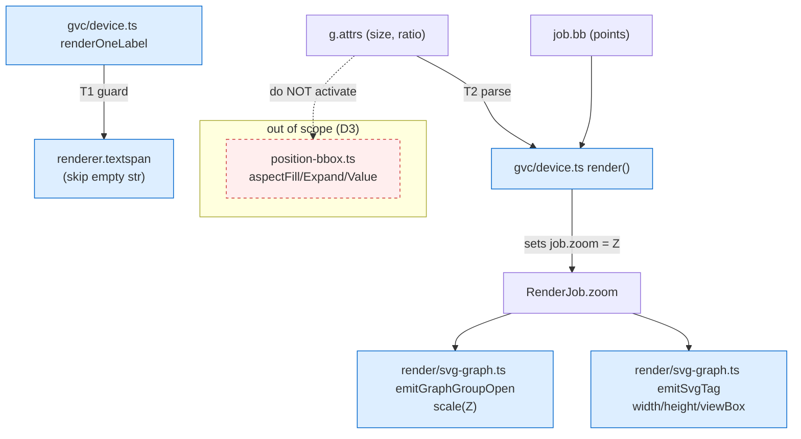

<!-- SPDX-License-Identifier: EPL-2.0 -->

# Component map — touched modules

- **Blue** = files edited (T1: `renderOneLabel`; T2: `render()`, `emitSvgTag`,
  `emitGraphGroupOpen`).
- **Red dashed** = `ratio=` layout reshaping, deliberately untouched (D3).
- No data-model, API-contract, or service-dependency changes (Layer-4 only).
