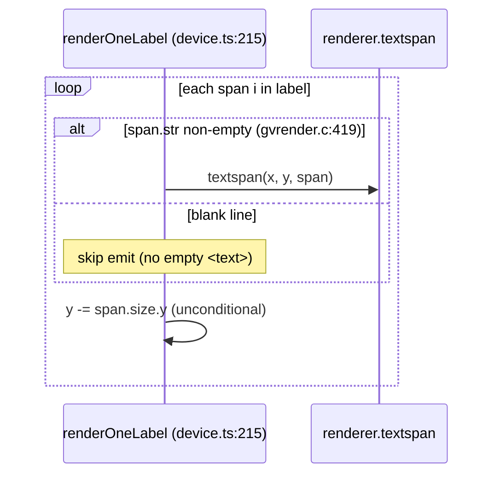

<!-- SPDX-License-Identifier: EPL-2.0 -->

# Data flow — `size=` scaling

## Render-time zoom computation (T2)

```mermaid
sequenceDiagram
    participant R as render() (device.ts:442)
    participant A as g.attrs
    participant J as RenderJob
    participant S as svg-graph.ts

    R->>J: job.bb = bb + pad (points)
    R->>A: get("size"), get("ratio")
    A-->>R: "6,6"  / "fill"|null
    R->>R: drawing.size = {x*72, y*72}; filled = "!" or ratio=="fill"
    R->>R: sz = bb.UR - bb.LL
    R->>R: Z = (size<sz || (filled && size>sz)) ? min(size/sz) : 1
    R->>J: job.zoom = Z
    R->>S: emitSvgTag(job)
    S-->>S: width/height/viewBox = round(dim * Z)
    R->>S: emitGraphGroupOpen(... job)
    S-->>S: transform="scale(Z Z) ... translate(tx ty)"
    Note over S: inner node/edge coords stay full-size (D4)
```

## Empty-label-span guard (T1)


