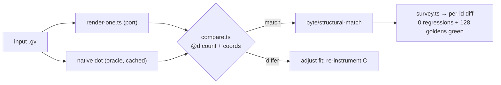

# Spline-segmentation — data flow

## Where the bezier control-point count is decided

```mermaid
flowchart TD
  A["dot layout: rank/mincross/position"] --> B["edge routing<br/>src/layout/dot/edge-route-*.ts"]
  B --> C["spline fit (corridor → piecewise cubic beziers)<br/>routesplines / Proutespline port<br/>splines-route.ts / edge-route-routing.ts"]
  C --> D["ED_spl(e): bezier control-point list<br/>(COUNT decided HERE)"]
  D --> E["emit: svgEdgePath / emitBezierPath<br/>src/render/svg-helpers.ts<br/>(outputs the stored points verbatim)"]
  E --> F['SVG path d="M.. C.."']
  C -. "DIVERGENCE: port emits a different<br/>number of bezier pieces than C" .-> C
```

The clean `path-structure` cases differ in the **count** of control points (C),
not their positions — so the root cause is in the **fit** (C), not the **emit**
(E). T1 confirms this by dumping both control-point lists.

## Verification loop (per input, per task)


